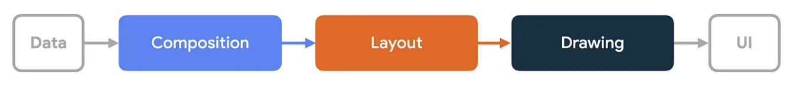

# Жизненный цикл

### Composition (Композиция)
Это процесс построения UI.

Compose вызывает функции с аннотацией @Composable и создает структуру дерева UI, которая содержит все необходжимые данные для следующих фаз.

Документация 
> Композиция : какой интерфейс показывать. Compose запускает компонуемые функции и создает описание вашего пользовательского интерфейса.

**Подробнее**
>Чтение состояния внутри функции @Composable или лямбда-блока влияет на композицию и, возможно, на последующие фазы. Когда значение состояния изменяется, средство повторной компоновки планирует повторные запуски всех компонуемых функций, которые считывают это значение состояния. Обратите внимание, что среда выполнения может решить пропустить некоторые или все составные функции, если входные данные не изменились. Дополнительную информацию см. в разделе «Пропуск, если входные данные не изменились».
>
>В зависимости от результата композиции Compose UI запускает этапы компоновки и рисования. Эти этапы могут быть пропущены, если содержимое останется прежним, а размер и макет не изменятся.

### Layout (Измерение и размещение)
Каждый узел измеряет все свои и дочерние элементы, затем размещает дочерние элементы, учитывая свои позиции. Результатом будут координаты для отрисовки.

Документация:
> Макет : где разместить пользовательский интерфейс. Этот этап состоит из двух этапов: измерения и размещения. Элементы макета измеряют и размещают себя и любые дочерние элементы в 2D-координатах для каждого узла в дереве макета.

>На этапе компоновки дерево просматривается с использованием следующего трехэтапного алгоритма:
>
>Измерить дочерние элементы : узел измеряет своих дочерних элементов, если таковые существуют.
>
>Определите собственный размер : на основе этих измерений узел определяет свой собственный размер.
>
>Разместить дочерние элементы : каждый дочерний узел размещается относительно собственной позиции узла.
>
>В конце этого этапа каждый узел макета имеет:
>
>Назначенная ширина и высота
>Координаты x, y, где это должно быть нарисовано

**Подробнее**
>Этап макетирования состоит из двух этапов: измерения и размещения . На этапе измерения выполняется лямбда-мера, передаваемая компонуемому Layout , методу MeasureScope.measure интерфейса LayoutModifier и т. д. Шаг размещения запускает блок размещения функции layout , лямбда-блок Modifier.offset { … } и т. д.
>
>Чтение состояния на каждом из этих шагов влияет на макет и, возможно, на этап рисования. Когда значение состояния изменяется, пользовательский интерфейс Compose планирует этап макета. Он также запускает этап рисования, если размер или положение изменились.
>
>Точнее, этап измерения и этап размещения имеют отдельные области перезапуска, а это означает, что считывание состояния на этапе размещения не вызывает повторный вызов предыдущего этапа измерения. Однако эти два шага часто переплетаются, поэтому считывание состояния на этапе размещения может повлиять на другие области перезапуска, относящиеся к этапу измерения.

### Отрисовка
Проходим по дереву, и просто отрисовываем все нужные элементы.

Документация:
> Рисование : как оно отображается. Элементы пользовательского интерфейса рисуются на холсте, обычно на экране устройства.

>Чтение состояния во время рисования кода влияет на фазу рисования. Общие примеры включают `Canvas()`, `Modifier.drawBehind` и `Modifier.drawWithContent`. При изменении значения состояния Compose UI запускает только фазу рисования.

### Recomposition (Перекомпозиция)
Если данные изменились, Compose повторно вызывает только те функции, которые зависят от этих данных.

Это очень эффективно и гибко, в отличие от полного обновления View.

### Invalidation (Инвалидация)
Когда State изменяется, связанные композируемые функции помечаются как "нуждающиеся в обновлении".

Это триггер для Recomposition.