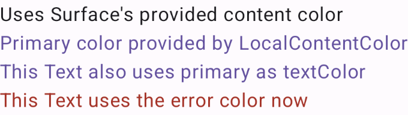

# CompositionLocal

CompositionLocal — это механизм, который позволяет передавать данные вниз по иерархии компонентов без явной передачи через параметры функций.

Как и State, по своей сути это прослушиваемый контейнер данных, который вы можете инстанцировать за пределами Composable скоупа и ссылаться на него статически. 

- CompositionLocal создается с помощью compositionLocalOf или staticCompositionLocalOf.
- Значение CompositionLocal устанавливается с помощью CompositionLocalProvider.
- Вы можете получить значение через current.

```
val ActiveUser = compositionLocalOf<User> { error("No active user found!") }

class MainActivity : AppCompatActivity() {
    override fun onCreate(savedInstanceState: Bundle?) {
        super.onCreate(savedInstanceState)
        setContent {
            val viewModel: MainViewModel = viewModel()
            CompositionLocalProvider(ActiveUser provides viewModel.user) {
                MyApp()
            }
        }
    }
}

@Composable
fun MyApp() {
    UserWidget()
}

@Composable
fun UserWidget() {
    val user = ActiveUser.current
    Text(text = user.name)
}
```

C помощью функции-билдера compositionLocalOf мы создаем объект класса CompositionLocal с типом User и записываем его в статическую переменную ActiveUser. 
В trailing лямбде можно вернуть дефолтный объект User’а, но если вам это не нужно, можно просто выкинуть исключение.

Далее где-то в Composable контексте (скорее всего в корне, но это необязательно) мы должны поставить данные в этот CompositionLocal. Это делается с помощью конструкции CompositionLocalProvider(ActiveUser provides viewModel.user) { //contnet }. 
Таким образом мы устанавливаем в ActiveUser некоторое значение, которое будет доступно только в подиерархии, что будет установлена вместо комментария content. Такой конструкцией мы можем оборачивать множество подиерархий и устанавливать для каждой свое значение user. Это правило работает даже для вложенных Provider’ов. Вот поэтому CompositionLocal не является side-эффектом.

Чтобы получить данные из CompositionLocal, нужно обратиться к Composable property CompositionLocal.current. Как и в случае со State, Compose понимает, что при изменении значения в конкретном CompositionLocal, нужно рекомпозировать зависимые от него Composable. Теперь данные из setContent идут напрямую в UserWidget, не касаясь при этом MyApp. Таким образом, мы достигли поставки данных в Composable в обход параметров, сохранив при этом возможность реагировать на изменение данных реактивно.

### compositionLocalOf vs staticCompositionLocalOf
compositionLocalOf — отслеживает изменения и может вызывать перерисовку компонентов.

staticCompositionLocalOf — не отслеживает изменения. Используйте, если значение не меняется в рантайме.

### Пример из документации с использованием дефолтных CompositionLocal
```
@Composable
fun CompositionLocalExample() {
    MaterialTheme {
        // Surface provides contentColorFor(MaterialTheme.colorScheme.surface) by default
        // This is to automatically make text and other content contrast to the background
        // correctly.
        Surface {
            Column {
                Text("Uses Surface's provided content color")
                CompositionLocalProvider(LocalContentColor provides MaterialTheme.colorScheme.primary) {
                    Text("Primary color provided by LocalContentColor")
                    Text("This Text also uses primary as textColor")
                    CompositionLocalProvider(LocalContentColor provides MaterialTheme.colorScheme.error) {
                        DescendantExample()
                    }
                }
            }
        }
    }
}

@Composable
fun DescendantExample() {
    // CompositionLocalProviders also work across composable functions
    Text("This Text uses the error color now")
}

```

